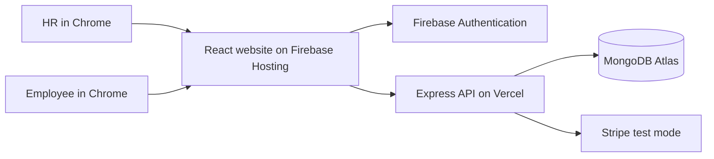

# AssetVerse Video Presentation Guide

A ready-to-use plan and speaking script for a **5–7 minute** project video. The wording is intentionally simple; change any sentence so it sounds natural in your voice.

## 1. What You Are Presenting

**AssetVerse** is a web application for managing workplace equipment and other company assets. It connects two kinds of users:

- **HR:** adds and manages company inventory, reviews employee requests, and manages employees.
- **Employee:** browses available inventory, requests an item, checks request status, and returns an approved returnable item.

The main idea is to make the asset process visible and organized: HR maintains the inventory, employees request what they need, and both sides can follow what happens next.

## 2. Project Parts

| Part | Technology | What it does |
|---|---|---|
| Web interface | React, Vite | Pages and forms used by HR and employees |
| User sign-in | Firebase Authentication | Email/password sign-in and account identity |
| API | Node.js, Express, hosted on Vercel | Receives requests from the website and performs application operations |
| Database | MongoDB Atlas | Stores user profiles, assets, requests, and payment records |
| Hosting | Firebase Hosting | Serves the production website |
| Payments | Stripe | Handles package checkout in Stripe test mode |

The website calls the API. The API reads and writes application data in MongoDB. Firebase handles the email/password sign-in, while the application also requests a JWT for API calls.



## 3. Before Recording

### Choose where to run the demo

**Simplest option:** use the live website at [https://asset-verses.web.app](https://asset-verses.web.app). The production API and MongoDB connection have been verified.

**Run it locally in VS Code:** open two terminals. Install dependencies once in each project with `npm install`.

Terminal 1, start the API:

```bash
cd /media/shuvon/WebDev/Assignment/Assignment-11/asset-verse-server
npm run dev
```

Terminal 2, start the website and point it at the local API:

```bash
cd /media/shuvon/WebDev/Assignment/Assignment-11/asset-verse-client
VITE_API_URL=http://localhost:5000 npm run dev -- --host 0.0.0.0
```

Open the local URL Vite prints in the terminal, usually `http://localhost:5173/`. If that port is occupied, Vite prints another port. Keep both terminals running during the recording. Do not change the committed production API URL just to run a local demo.

### Prepare the demo data

1. Open the live website: [https://asset-verses.web.app](https://asset-verses.web.app).
2. Use the HR and employee test accounts created for this project. Get their passwords from your own saved credentials; **do not show or say passwords in the video**.
3. Sign in as HR and add one clearly fictional asset, for example `Demo Laptop`, type `Returnable`, quantity `3`.
4. Sign in as the employee in a separate Chrome profile or Incognito window. Confirm the demo asset appears under **Request Asset**.
5. If demonstrating the full request lifecycle, submit a request as the employee. Return to the HR session, approve it, then show its updated status in the employee session.
6. Test each step once before recording. The video should show the successful path, not the preparation or troubleshooting.

The database is shared with the live application. Use only clearly labeled demo data. Requests, approvals, payments, and employee affiliations can persist after the recording. Avoid completing a real payment; Stripe is in test mode, but payment records and package limits can still change.

### Prepare Chrome and your recording

- Use a clean Chrome window at 100% zoom and the live website URL above.
- Close unrelated tabs, chat notifications, password managers, and personal information.
- Use OBS Studio or another screen recorder. Choose a 16:9 landscape canvas, capture the Chrome window, select your microphone, and make a short audio test.
- Keep the pointer movements slow. Pause briefly after each important page change so viewers can read the screen.
- Never record `.env` files, database credentials, API keys, tokens, or password fields.

## 4. Recommended Run of Show

| Time | Show | Explain |
|---|---|---|
| 0:00–0:30 | Home page | The problem AssetVerse addresses |
| 0:30–1:00 | HR and employee roles | The two user workflows |
| 1:00–2:00 | HR asset list and add form | Inventory management |
| 2:00–2:45 | Employee request page | Finding and requesting an asset |
| 2:45–4:00 | HR requests page | Reviewing and approving or rejecting requests |
| 4:00–4:40 | Employee My Assets / My Team | Following status and company affiliation |
| 4:40–5:30 | Architecture diagram or project folders | How the website, API, auth, and database fit together |
| 5:30–6:00 | Closing | Summary and next improvements |

You can skip the approval/return sequence if time is short. A clear asset-add and request workflow is better than rushing through every screen.

## 5. Read-Aloud Video Script

### Opening | 0:00–0:30

> Hello, my name is [your name], and this is my project, AssetVerse. AssetVerse is a web application for managing company assets. It helps a company keep track of its inventory and gives employees a clear way to request the items they need.

### The users | 0:30–1:00

> The application has two main roles: HR and employee. HR manages the company’s assets and reviews requests. Employees can browse available assets, submit requests, and follow their request status. I’ll show both sides of that workflow.

### HR inventory | 1:00–2:00

> I’m signed in as HR. The asset list shows the company’s inventory. HR can search and filter the list, add a new asset, update its details, and remove an item. I’ll add this fictional demo laptop with a quantity of three. The item is now available for employees to request.

**Action:** Show the asset list, then add the fictional demo item. Pause after the success message and after it appears in the list.

### Employee request | 2:00–2:45

> Now I’m signed in as an employee. This page shows available inventory. I can search or filter the items and submit a request. I’ll request the demo laptop. The application records the request so HR can review it.

**Action:** Show the available item and submit one request. Do not show the password while signing in.

### HR review | 2:45–4:00

> Back in the HR account, the new request appears in the request list with the employee and request details. HR can approve or reject a pending request. I’ll approve this demo request. Approval updates the request status and adjusts the available quantity.

**Action:** Show the pending request, approve it, and pause on the updated status.

### Employee status | 4:00–4:40

> The employee can now see the request status in My Assets. The employee can also view their team information after joining a company through the approval workflow. For a returnable item, the employee can return it later, which restores the inventory quantity.

**Action:** Show My Assets. If you have tested the return flow and want a complete lifecycle demo, return the item and show the updated status. This changes live demo data, so only do it with the dedicated test accounts and demo asset.

### How it is built | 4:40–5:30

> The website is built with React and Vite. Firebase Authentication handles email and password sign-in. The website sends API requests to a Node.js and Express backend hosted on Vercel. The backend stores users, assets, and requests in MongoDB Atlas. The website is hosted on Firebase Hosting. Stripe is connected for package checkout in test mode.

**Action:** Show the architecture diagram from this guide, or briefly show the client and server project folders in VS Code. Do not open configuration files containing secrets.

### Closing | 5:30–6:00

> To summarize, AssetVerse brings company inventory and employee requests into one workflow. HR can manage assets and decisions, while employees can request items and follow their status. Thank you for watching my presentation.

## 6. What to Say if Asked

**Why did you build it?**

> I wanted to make asset inventory and employee requests easier to track than handling them through separate messages or spreadsheets.

**Where is the data stored?**

> The application stores user profiles, assets, requests, and payment records in MongoDB Atlas. Sign-in identities are handled by Firebase Authentication.

**What would you improve next?**

> I would strengthen server-side authorization so every API operation verifies the signed-in Firebase identity, role, and ownership. I would also use a static outbound IP or private network connection for the production API instead of a broad Atlas IP allowlist, and add automated end-to-end tests.

**What is the payment integration?**

> Stripe is integrated in test mode for package checkout. The demo does not process real payments.

## 7. Important Accuracy and Safety Notes

- Do not describe the current API as fully secure. It issues an application JWT from supplied user information, and server-side role and ownership checks still need improvement.
- Atlas currently allows network connections from `0.0.0.0/0` because the Vercel deployment has no fixed egress IP configured. The database user is restricted to `readWrite` on the `assetVerse` database, but replacing the broad network rule with static egress or a private connection is a production hardening task.
- Do not say that a test payment is a real transaction.
- Do not show passwords, access tokens, API keys, database URIs, `.env` contents, or personal records.
- Use fictional asset names and test users in the recording.

## 8. Final Recording Checklist

- [ ] Live website loads in Chrome.
- [ ] HR and employee accounts can sign in.
- [ ] A fictional demo asset is available before recording the employee screen.
- [ ] The employee request is visible to HR.
- [ ] The recording does not expose credentials or personal data.
- [ ] Microphone audio is clear and screen text is readable.
- [ ] The video ends with a short summary.
- [ ] Any demo data you do not want to retain is removed after recording.
